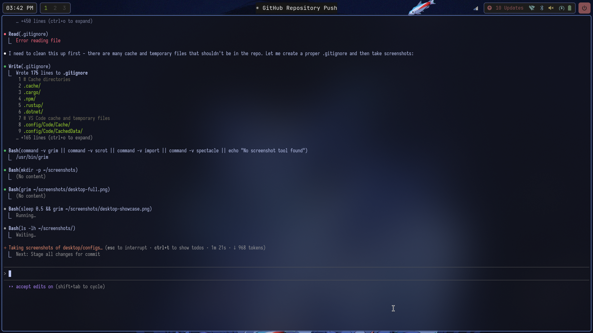
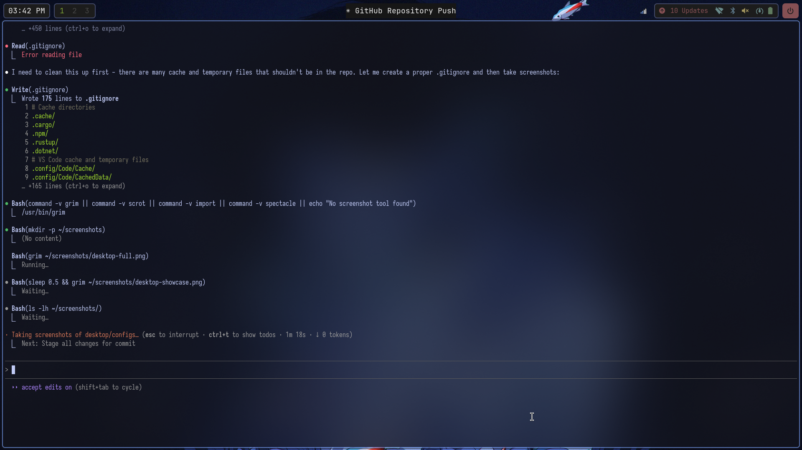

## my arch linux dotfiles

## Screenshots

### my choice of software:
distro: `arch` \
wm: `hyprland` \
terminal emulator: `foot` \
shell: `zsh with starship prompt` \
application launcher: `wofi` \
bar: `waybar` \
text editor: `neovim` \
browser: `firefox` \
file manager: `thunar & yazi` \
notifications: `dunst` \
image viewer: `imv` \
video player: `mpv` \
pdf viewer: `zathura` \
screenshot tool: `grim + slurp` \
screen recording: `obs` \
music player: `spotify & deadbeef`

