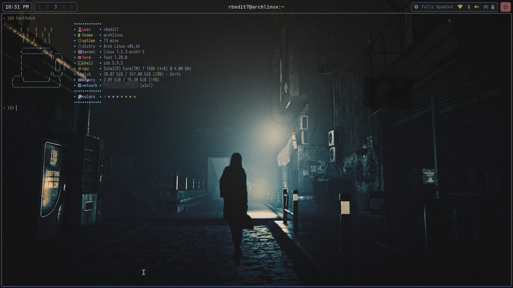
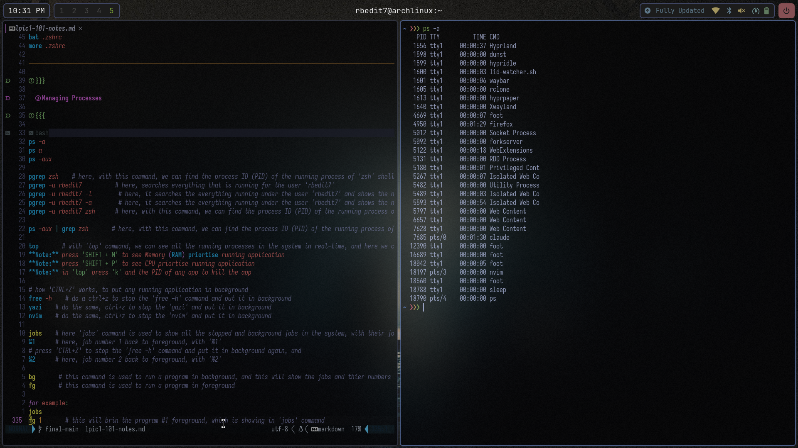

# Arch Linux + Hyprland dotfiles

My daily-driver rice: Hyprland on Arch, configured in **Lua** (Hyprland 0.56/0.57's
`hyprland.lua` config format) rather than the classic `hyprland.conf`.

## Screenshots

Desktop — foot over `mima.png` with waybar's `unique` theme and fastfetch:



Tiled workspace — neovim beside a shell:



## Software

| Role | Choice |
|---|---|
| distro | `arch` |
| compositor | `hyprland` 0.56.2 (Lua config) |
| bar | `waybar` (24 swappable themes, `unique` active) |
| terminal | `foot` |
| shell | `zsh` + `starship` |
| launcher | `wofi` (`SUPER+D`) and `fuzzel` (`SUPER+Space`) |
| editor | `neovim` (lazy.nvim, `lua/rb/`) |
| browser | `firefox` |
| file manager | `thunar` + `yazi` |
| notifications | `dunst` |
| lock / idle | `hyprlock` + `hypridle` |
| wallpaper | `hyprpaper` |
| screenshots | `grim` + `slurp` |
| system monitor | `btop` |
| fetch | `fastfetch` |
| pdf | `zathura` |
| multiplexer | `tmux` |

## Layout

```
.config/
├── hypr/              # hyprland.lua, hyprlock, hypridle, hyprpaper, shaders, 29 scripts
│   ├── scripts/       # theme switching, wifi menu, volume, wallpaper, cliphist, ...
│   ├── shaders/       # Shader.frag and friends
│   └── wallpaper/     # wallpapers referenced by hyprpaper.conf
├── waybar/themes/     # 24 bar themes + theme-switcher (SUPER+S)
├── nvim/lua/rb/       # neovim config: core/, plugins/, lsp/
├── foot/              # terminal
├── yazi/              # file manager + catppuccin-mocha flavor
├── fastfetch/         # fetch config, ascii logos
├── rofi/              # colour palettes (themes/) + active-theme pointer
├── wlogout/           # colour palettes (colors/) + active-theme pointer
└── ...                # wofi, fuzzel, dunst, btop, tmux, zathura, gtk, qt
.zshrc                 # zsh + starship, aliases, note-taking helpers
pkglist.txt            # explicitly installed packages, repo + AUR split
```

## Notable keybinds

| Bind | Action |
|---|---|
| `SUPER+Return` | foot terminal |
| `SUPER+D` / `SUPER+Space` | wofi / fuzzel launcher |
| `SUPER+E` | thunar |
| `SUPER+B` | firefox |
| `SUPER+S` | waybar theme switcher |
| `SUPER+R` | foot theme switcher |
| `SUPER+SHIFT+B` | foot blur toggle |
| `SUPER+SHIFT+W` | restart waybar |

**Full reference for every keybind — Hyprland, tmux, neovim, foot and yazi — is in
[`KEYBINDS.md`](KEYBINDS.md).** Hyprland's binds are defined in
[`.config/hypr/hyprland.lua`](.config/hypr/hyprland.lua); `shortcuts.conf` is legacy
and no longer sourced.

## Install

These are personal configs — read before running. Paths inside them are absolute
(`/home/rbedit7/...`) in a few places and will need adjusting.

```sh
git clone https://github.com/raman164/dotfiles-hyprland.git
cd dotfiles-hyprland
# copy the pieces you want into ~/.config/
cp -r .config/hypr ~/.config/
```

Packages are listed in `pkglist.txt` (repo and AUR sections separated):

```sh
pacman -S --needed - < <(awk '{print $1}' pkglist.txt | grep -v '^#')
```

Note: `rofi/` and `wlogout/` here are colour palettes only. The Hyprdots-style
scripts in `hypr/scripts/` (`rofilaunch.sh`, `logoutlaunch.sh`) expect a fuller
layout — `rofi/config.rasi`, `rofi/styles/`, `wlogout/layout` — which is not
included; those scripts are only wired up from the inactive `bizare-*` waybar
themes.

## Notes

This repo tracks configuration only. Application state, caches, browser and editor
profiles, and anything credential-bearing are excluded by an allowlist `.gitignore`
— if you fork this, keep it that way.
